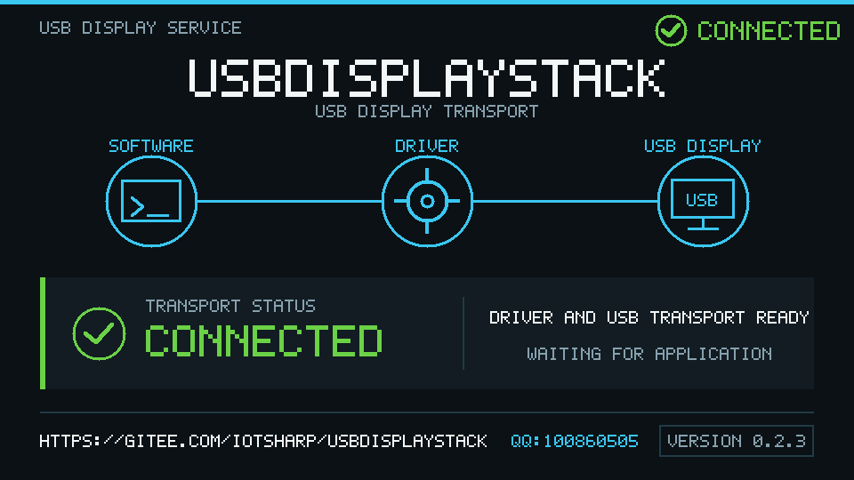
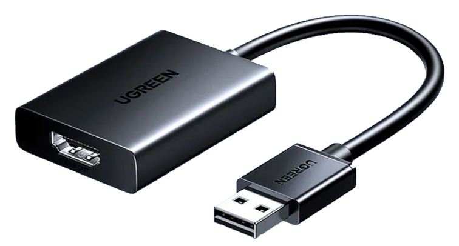

# USBDisplayStack

English | [简体中文](README.zh-CN.md)

USBDisplayStack is a GPL-2.0-only Linux display stack for USB display
adapters that use vendor-specific transport protocols. Applications render to
normal framebuffer or DRM/KMS devices; protocol, compression, and USB details
stay in replaceable userspace backends.

> **Alpha status:** the virtual DRM/fbdev frontend and userspace frame path are
> working on Linux 4.15. The Actions Micro `185b:2d1d` live backend is
> implemented but remains experimental and is not enabled by default.

## Quick install

The CI pipeline publishes one kernel-bound Debian package. Open
[GitHub Actions](https://github.com/IoTSharp/USBDisplayStack/actions), select a
successful `build` run, download the `usbdisplay-stack-deb-<version>` artifact,
and extract its `.deb` file.

The current CI package targets Linux `4.15.0-60-generic` and Debian `i386`.
Confirm the target before installing:

```bash
uname -r
dpkg --print-architecture
```

When those commands report `4.15.0-60-generic` and `i386`, install the single
package through APT:

```bash
sudo apt install ./usbdisplay-stack_*+kernel.4.15.0-60-generic_i386.deb
```

APT automatically installs `ffmpeg`, `kmod`, `systemd`, `udev`, and compatible
runtime libraries. Check the installed package and the current display state:

```bash
dpkg -s usbdisplay-stack
usbdisplay-check --json
```

Installation intentionally does not load the kernel module or enable the
service. An Actions Micro adapter also requires an authorized replay template;
until that explicit activation is complete, `usbdisplay-check` reporting
not-ready is expected. See the
[Debian package and activation guide](docs/offline-deb.zh-CN.md) for the full
procedure and offline-install option.

## Architecture

```text
LVGL or another application
          |
          +----> /dev/fbN (fixed XRGB8888 framebuffer)
          |
          +----> /dev/dri/cardN (DRM/KMS virtual connector)
                         |
                         v
                usbdisplay kernel module
                triple-buffer snapshot ABI
                         |
                  /dev/usbdisplay0
                         |
                         v
                    usb-displayd
                         |
             dynamically loaded backend
                         |
             codec / HID / USB transport
```

The module never falls back to `/dev/fb0`. If the USB transport or backend is
missing, the secondary display stops while the primary display remains
untouched.

See [architecture](docs/architecture.md), [ABI](docs/abi.md), and
[compatibility](docs/compatibility.md) for the contracts between layers.

## Components

- `kernel/usbdisplay_drv.c`: virtual DRM/KMS device, independent fbdev, and
  read-only triple-buffer stream.
- `userspace/usb-displayd.c`: single-consumer frame dispatcher.
- `backends/null`: diagnostics and throughput testing.
- `backends/ppm`: writes the latest frame as a PPM image.
- `backends/actions-micro`: initialization, heartbeat, FFmpeg H.264, and HID
  video transport for Actions Micro `185b:2d1d`.
- `tools/fb-test-pattern`: writes a color pattern through `/dev/fbN`.
- `tools/drm-probe`: checks connectors and modes using DRM ioctls without
  requiring libdrm.
- `tools/actions-micro-replay`: validates and explicitly replays captured
  `185b:2d1d` HID reports for protocol research.
- `examples/lvgl`: LVGL 9 applications for fbdev and DRM/KMS.
- `examples/csharp`: .NET 8 applications for fbdev and DRM/KMS.

## Requirements

The current kernel implementation targets the TinyDRM API present in Linux
4.15. It requires these kernel options:

```text
CONFIG_DRM
CONFIG_DRM_KMS_HELPER
CONFIG_DRM_TINYDRM
CONFIG_FB
CONFIG_FB_DEFERRED_IO
```

Install the compiler, make, and headers matching the running kernel before
building.

The experimental Actions Micro backend requires `ffmpeg` built with the
`libx264` encoder. The optional examples require LVGL 9/libdrm or .NET 8 as
described in their local READMEs.

## Build

```bash
make userspace
make module
# Optional, when LVGL 9 and libdrm development files are installed:
make examples-lvgl
```

The userspace binaries are written to `build/`; the module is
`kernel/usbdisplay.ko`.

## Manual smoke test

The example uses a small mode to keep the test output compact:

```bash
sudo modprobe tinydrm
sudo insmod kernel/usbdisplay.ko width=640 height=360

build/drm-probe /dev/dri/card1 640 360
build/usb-displayd \
  --backend build/usbdisplay-ppm.so \
  --backend-option /tmp/usbdisplay.ppm &
daemon_pid=$!

sudo build/fb-test-pattern /dev/fb1
sleep 1
kill "$daemon_pid"
sudo rmmod usbdisplay
```

Do not assume the secondary nodes are always numbered `1`; discover them by
the `usbdisplay` framebuffer name and DRM driver name in production scripts.

The daemon writes `/run/usbdisplay/ready` after the selected backend has opened
successfully. The marker contains `pid`, `generation`, `backend`, and
`physical`; consumers require a positive generation and `physical=1` for a real
HDMI transport. The null and PPM diagnostic backends intentionally publish
`physical=0`. The daemon removes the marker on disconnect, increments the
generation after recovery, and waits inside the same process for reconnect.
The virtual framebuffer can exist without a USB adapter. `--ready-file PATH`
and `--retry-ms N` customize the marker and retry interval.

When the physical backend and driver are ready but no fbdev or DRM producer is
open, the daemon renders a built-in status splash. The splash shows the proven
`SOFTWARE -> DRIVER -> USB DISPLAY` connection, the project address,
`QQ:100860505`, and the package build version. A static application frame is
never replaced by an inactivity timeout; the splash returns only after the
last producer closes.



## Application examples

Run only one producer at a time. Both LVGL examples render the same dashboard:

```bash
make -C examples/lvgl
sudo build/examples/lvgl-fbdev-example /dev/fb1
sudo build/examples/lvgl-drm-example /dev/dri/card1
```

The C# examples render animated XRGB8888 patterns and refuse devices that are
not owned by USBDisplayStack:

```bash
dotnet run --project examples/csharp/Fbdev -- /dev/fb1
dotnet run --project examples/csharp/Drm -- /dev/dri/card1
```

## Source install and packaging

`scripts/install.sh` installs the module built for the running kernel,
userspace binaries, backends, udev rules, and systemd files. It deliberately
does not load the module or enable the service.

```bash
sudo ./scripts/install.sh
sudo systemctl enable --now usb-displayd.service
```

Set the virtual resolution in `/etc/modprobe.d/usbdisplay.conf` and select a
backend in `/etc/default/usb-displayd` before enabling the service.

For a kernel-bound i386 Debian artifact, compile the userspace stack and build
the package in the PCCT image without bind-mounting the source tree:

```powershell
pwsh ./scripts/build-pcct-deb.ps1 \
  -Version 0.2.3 \
  -KernelModule /path/to/usbdisplay.ko
```

GitHub Actions runs the same PCCT packaging path on every push and pull request.
It uploads the `.deb`, its SHA-256 sidecar, and the offline installer as a
workflow artifact. A `vX.Y.Z` tag uses `X.Y.Z`; the manual workflow dispatch can
override the version when a release artifact is needed.

The package contains its Debian lifecycle hooks and all project installation
scripts. It deliberately does not activate the module or select the physical
backend because that requires an authorized replay template and explicit lane
configuration. See the [Debian package guide](docs/offline-deb.zh-CN.md) for
offline installation, physical backend configuration, and artifact boundaries.

`usbdisplay-check` is suitable for installers and supervisors. Its default
exit status is zero only when the virtual devices, live daemon marker, physical
backend, and expected `185b:2d1d` USB adapter are all present:

```bash
usbdisplay-check
usbdisplay-check --json
```

## Actions Micro activation

The live backend requires an authorized `DPRPL001` replay template containing
the adapter's initialization and heartbeat commands. Captured video is ignored
by default; `bootstrap=full` explicitly sends it once on firmware that requires
a full captured stream to leave its waiting page. Replay data is never
distributed by this project. Configure the reference adapter with:

```text
USBDISPLAY_BACKEND=/usr/lib/usbdisplay/usbdisplay-actions-micro.so
USBDISPLAY_BACKEND_ARGS=--backend-option template=/var/lib/usbdisplay/actions-micro.replay,bootstrap=full
```

The backend discovers and verifies both `185b:2d1d` hidraw interfaces, sends
initialization, maintains heartbeats while idle, and converts new fbdev or DRM
frames into baseline H.264 and vendor HID reports. With the module and service
running, an LVGL write to the USBDisplayStack framebuffer automatically enters
that pipeline. See the [supported device list](docs/supported-devices.md) and
[Actions Micro 185b:2d1d](docs/actions-micro-185b-2d1d.md) for the matching USB
identity, options, and current validation limits.



## Experimental hardware work

The Actions Micro research notes and replay safety rules are documented in the
link above. Both captured Windows output and live generated LVGL output have
displayed successfully on the reference unit. The backend remains experimental
until repeated reconnect and long-running tests are complete.

## License

USBDisplayStack is licensed under `GPL-2.0-only`. See [LICENSE](LICENSE).
